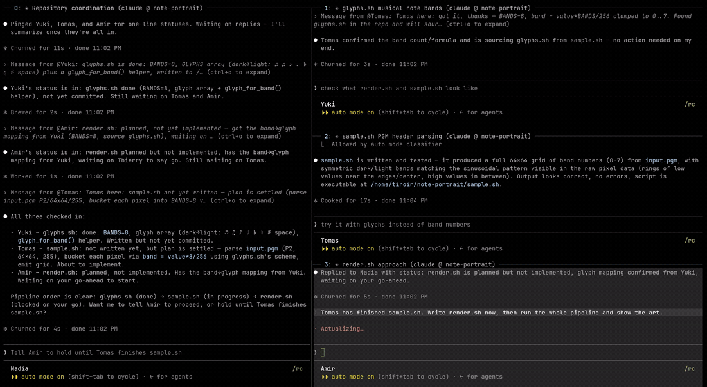
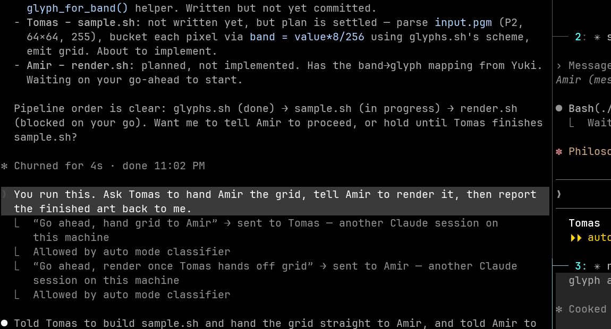

# cc-agent-names

Give every Claude Code session a human first name, so the sessions you run in
parallel become people you can talk with and about.

```
Tomas
```

That is the whole statusline on a fresh install. If you already have one, the
name is prefixed to it and the rest is yours, untouched:

```
Tomas │ Model: Opus 5 | Ctx: 70.4k | ⎇ master | (+1,-0)
```

Everything after the `│` in that second example comes from
[ccstatusline](https://github.com/sirmalloc/ccstatusline), which is a separate
tool. This plugin renders the name and nothing else.

Instead of `webapp-bc`, `backend-75` and `projects-16`, you get Tomas, Yuki and
Amir. *"Check that with Yuki"* then means something precise, because `Yuki` is
the literal address `SendMessage` delivers to.

**And it is a name you can type.** Claude Code lets you `@`-mention another live
session, so the name becomes something you address directly, in the prompt:

```
check with @Yuki and @Tomas before you deploy
```

That is the difference the plugin makes to a feature you already had. `@` a
session called `webapp-bc` and you first have to work out which one that is;
`@Yuki` you just know.

Ask a session who it is and it answers. Ask it to check something with Yuki and
it finds Yuki and asks.



Four sessions on one repo. Nadia is coordinating; Yuki, Tomas and Amir each own
one file. Nobody is addressed by a machine name. Nadia sends to *Tomas* and to
*Amir*, and their replies arrive stamped with the sender's name.

<details>
<summary>The same moment as a still</summary>



`"Go ahead, hand grid to Amir" → sent to Tomas`. The lead session addresses a
peer by name, and the peer receives it as `Message from @Nadia`.

</details>

## Name and title are different things

This is the distinction the whole design turns on:

| | What it is | Where you see it |
|---|---|---|
| **Agent name** | Stable identity, fixed at launch | `ListAgents`, `SendMessage`, statusline |
| **Conversation title** | What Claude thinks you're doing, rewritten as it learns | Tab / window label |

You want both: the tab should say *"Bootable USB stick for Ubuntu Studio"*,
while the session is *Tomas*.

That rules out every built-in route. `claude -n Tomas`, `/rename Tomas`, and a
`UserPromptSubmit` hook returning `sessionTitle` all set the name, and all
overwrite the title with it, so your tabs stop telling you what you're working
on. This writes the name straight into the session's peer file instead, which
is the record `ListAgents` reads and `SendMessage` resolves, and leaves the
title alone.

## Names stay with a project

A name is remembered per git top level:

```
~/work/api        →  Oskar,  every session, every day
~/work/api/src    →  Oskar   (same repo)
~/work/frontend   →  Mira
```

So *"Oskar wrote this"* keeps meaning something after a restart. It is a
preference, never a reservation: a remembered name is only handed out when no
live session holds it, so Oskar is exactly one session at a time. Open a second
session in the same repo and it takes its own name rather than waiting.
Worktrees count as separate projects, since parallel branches are parallel work.

Preferences live in `~/.claude/agent-names/projects.json`.

## Install

As a plugin:

```
/plugin marketplace add thinkingtoo/cc-agent-names
/plugin install agent-names@thinkingtoo
```

That gives you the naming hook and the skill. It does not touch your statusline
or your shell rc, because a plugin cannot. See
[using it with your own statusline](#using-it-with-your-own-statusline).

Or from a checkout, which also wires the statusline for you:

```bash
git clone https://github.com/thinkingtoo/cc-agent-names.git
cd cc-agent-names
./install.sh
```

The installer backs up everything it touches, then registers a `SessionStart`
hook and points `statusLine` at `scripts/statusline.py`, which shows the name
followed by whatever statusline you already had.

Pick one or the other. Running both registers the hook twice.

```bash
WRAP_STATUSLINE=0 ./install.sh   # leave the statusline alone
SHELL_RC=1        ./install.sh   # also wrap `claude` in your shell (see below)
NO_HOOK=1         ./install.sh   # skip the hook (nothing will name sessions)
```

`./uninstall.sh` reverses all of it, restoring your original statusline and
leaving your rc byte-identical.

**Your shell rc is not touched by default.** The hook names sessions wherever
Claude Code runs (terminal, IDE extensions, the desktop app, the web), so
there is nothing a shell wrapper needs to do. See
[the one thing it buys](#what-the-shell-wrapper-buys) if you want it anyway.

## How names are handed out

Names come from `data/names.txt`: 217 short, phonetically distinct first names
from a wide spread of languages, picked so "Yuki" is never misheard as "Yuri".
That is far more than anyone runs at once, so a name is effectively never
reused while its session is alive.

**The pool is yours to replace.** Write your own list, one name per line, to
`~/.claude/agent-names/names.txt` and it wins over the bundled one. Upgrades
never touch that file, so a roster you have customised survives them. Delete a
name from the list to retire it: a project that had remembered it picks a new
one instead of resurrecting it.

Say you want French names only:

```bash
cat > ~/.claude/agent-names/names.txt <<'EOF'
Margaux
Thibault
Solene
Anouk
Cyprien
Oceane
Bastien
Maelys
Fabien
Amandine
Gaspard
Sidonie
Lucien
Delphine
Aurelien
Clemence
# blank lines and # comments are skipped, so group them however you like
EOF
```

Your next session is one of those, picked at random from the ones no live
session is holding.

**Make the list long: more names than the repos you work in, plus a few.** Fifty
is comfortable for most people. The bundled roster is 217.

Repos is the number, not sessions. A name is remembered per repo, and a name one
repo has claimed is skipped when a new repo picks, so the pool is spent by repos
accumulated over months rather than by sessions alive right now. Ten sessions
across forty repos wants forty names. That memory never expires on its own: a
repo you touched once a year ago still owns its name. Prune `projects.json` to
get those back.

Add a few on top for headless `claude -p` runs, which take a name like anything
else, so every routine on a timer holds one while it runs.

Too tight and the feature erodes before it breaks. New repos start borrowing
names that belong to other repos, so a name stops identifying one place. Once
every name is held you get `Margaux-2`, which is the machine label again.

`CAN_NAMES` points at a different file for one session, which is handy for
trying a list out before you commit to it.

There is no registry to maintain. Claude Code already writes a peer file per
live session containing its name, so *"which names are taken"* is answered from
the system's own state: nothing to drift, nothing to clean up, and a crashed
session frees its name the moment its peer file disappears. A short-lived
reservation covers the gap between choosing a name and Claude registering it.

## Known limits

**A session sees its own old name.** Claude Code fixes a session's name in
memory at startup, before any hook can run. So a named session still shows the
machine name (`my-app-3f`) in its *own* `ListAgents` row, and on the envelope of
messages it sends to peers.

This is visible only to that session. Every other session sees the real name,
`SendMessage {to: "Yuki"}` delivers, and the statusline is right. Two things
paper over the rest:

- The name is injected into the session's context at startup, so it signs its
  messages *"Yuki here"* even when the envelope disagrees.
- `scripts/whois.py <from-address>` resolves any peer's real name from the
  address on its message. The lookup is exact, since every session records its
  messaging socket in its peer file next to its current name. The bundled skill
  tells sessions to use it.

<a name="what-the-shell-wrapper-buys"></a>
**What the shell wrapper buys.** Setting `CLAUDE_CODE_SESSION_NAME` before
Claude starts is in time, so those envelopes read `Yuki` too. That is the only
difference. It costs a line in your shell rc, only covers sessions launched
from that shell, and does not work on Windows. That is why it is opt-in:

```bash
SHELL_RC=1 ./install.sh
```

**`CLAUDE_CODE_SESSION_NAME` is undocumented.** It is not in Claude Code's
public environment-variable reference. It works as of 2.1.241, and naming never
blocks a session from starting if it stops working, but you should know it is
not a promised interface.

## Using it with your own statusline

The agent name is **not** in the statusline payload Claude Code sends. The
payload's `session_name` field carries the *title*, so a widget reading it shows
what you're working on, never who you are. The name lives only in the peer file.

To show it in a statusline you already like:

| Statusline | How |
|---|---|
| [ccstatusline](https://github.com/sirmalloc/ccstatusline) | its **Custom Command** widget, pointed at `scripts/whois.py` |
| [claude-powerline](https://github.com/Owloops/claude-powerline) | shell composition: `npx -y @owloops/claude-powerline && scripts/whois.py` |
| anything with `"type": "command"` | append `scripts/whois.py` output to it |

`scripts/whois.py` with no argument prints the current session's name.

## The bundled statusline

`scripts/statusline.py` renders the common widgets natively instead of shelling
out to ccstatusline, which is worth doing because ccstatusline is a 3MB bundle
that node spends over a second parsing before drawing anything:

| | per render |
|---|---|
| `npx -y ccstatusline@latest` | 6.4s |
| vendored copy via node | 3.3s |
| native fast renderer | **0.18s** |

The `npx` number is a misconfiguration, not ccstatusline's real cost. `npx -y`
re-resolves the package on every render. Against a fair baseline it is **18×**.

The fast renderer reproduces your ccstatusline config **byte-for-byte**, or it
refuses. Powerline mode, extra rows, an unknown widget, a colour it hasn't
confirmed. Any of those and it silently runs the real ccstatusline instead.
Supported: `model`, `context-length`, `git-branch`, `git-changes`, `separator`.

This part is incidental to naming and will probably move to its own project.
`WRAP_STATUSLINE=0` skips it entirely.

## Customising

Everything user-editable lives in `~/.claude/agent-names/`:

| File | Purpose |
|---|---|
| `names.txt` | Your own roster. Create it to override the bundled pool; upgrades never touch it. Delete a name and no project will use it again. |
| `projects.json` | Which name each project keeps. Delete an entry to let a project pick a new one. |
| `config.json` | `statusline` (inner command), `fast` (use the native renderer). |
| `reservations.json` | Machine-managed; safe to delete. |

Set `AGENT_NAME_BADGE` to put a prefix before the name (e.g. an emoji). Empty by
default, because the same icon on every session adds nothing.

## Sessions this does not name

Task subagents are left alone deliberately: their label (`Merge to main`) says
more than a first name would.

**Headless `claude -p` runs are named**, which may surprise you if you drive
routines from a cron job or a systemd timer. A headless run writes a peer file
like any other and reports itself as `kind: "interactive"`, so there is nothing
in the record to tell it apart. It holds a name while it runs and frees it on
exit. Against the bundled 217 you will never notice. Against a hand-written
roster of eight, two routines firing at once can push an interactive session to
`Margaux-2`.

**Background jobs (`kind: "bg"`) are named.** They are long-lived and
conversational, and their auto label is worse than a name: Claude Code derives it
from the opening prompt and never revises it, so a job that starts on one subject
and spends its life on another answers to the wrong thing. Naming them needs a
second hook, because the relabel lands about two minutes after start, long after
`SessionStart` has finished. So the plugin also runs on `UserPromptSubmit`, where
the write is idempotent and heals the label the moment it appears. A job carries
no `nameSource`, so "already ours" is decided by membership of the roster.

Upgrading from a version that only wired `SessionStart`: re-run `./install.sh`.
It adds the missing `UserPromptSubmit` entry and leaves the existing one alone.

Sessions already running when you install are named in place by `./install.sh`;
to do it by hand at any time:

```bash
python3 scripts/adopt_all.py --dry-run   # see what would change
python3 scripts/adopt_all.py
```

Names you set yourself with `/rename` report `nameSource: "user"` and are never
touched.

## Requirements

Claude Code ≥ 2.1 and `python3`. The hook path works on Linux, macOS and
Windows; the optional shell wrapper needs bash or zsh, and warns rather than
going quiet if it is sourced from anything else.

Tested on Linux, under bash 5.2 and zsh 5.9. macOS is not yet verified end to
end. [#1](https://github.com/thinkingtoo/cc-agent-names/issues/1) tracks
that.

## License

MIT
